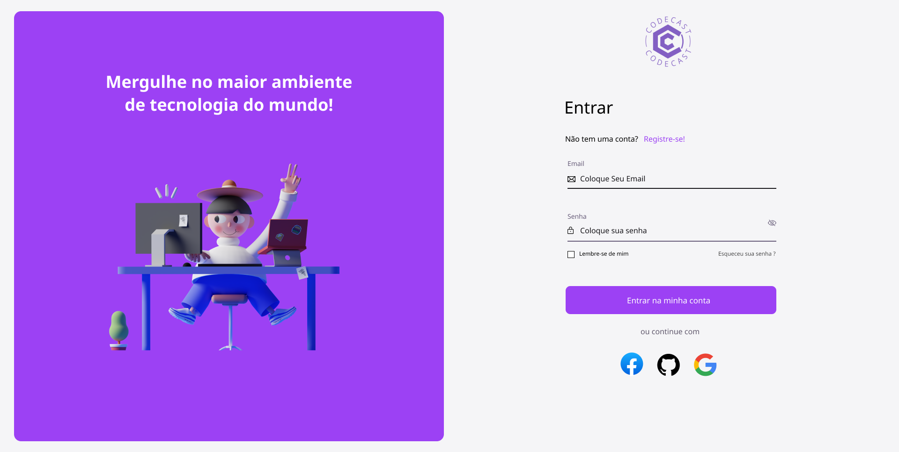

<div align="center">
    
</div>

# Code Cast
**Número do Grupo:** 6  
**Disciplina:** Engenharia de software III  
**Professor:** Cleber Araujo


## Alunos
| Matrícula        | Aluno         | Cargo                 |
|------------------|---------------|-----------------------|
| 2022123TADS0195  | Alan Manoel   | Gerente de Qualidade  |
| 2022123TADS0063  | João Vitor    | Desenvolvedor Sênior  |
| 2022123TADS0128  | Lucas Eduardo | Analista de Requisitos|
| 2022123TADS0071  | Luis Alberto  | Arquiteto de Software |

## Sobre
Este repositório inclui um documento abrangente que oferece uma visão detalhada da arquitetura do sistema destinado ao streaming de vídeos e transmissão ao vivo de conteúdo relacionado à programação. Elaborado como um recurso orientador para desenvolvedores de software, o guia visa documentar de maneira clara e abrangente os requisitos essenciais necessários para a bem-sucedida construção deste sistema inovador. Este trabalho foi realizado no âmbito da disciplina de Engenharia de Software III, sob a supervisão do professor Cleber Araujo.

## Screenshots
*Tela de Login* 
*Tela de inicio dos usuários* 

## Instalação
**Linguagens:** 
- TypeScript
- Python

## Uso
1. Clone o repositório:
    ```bash
    git clone https://github.com/luisalberto002/codecast.git
    ```

2. Navegue até o diretório clonado:
    ```bash
    cd codecast
    ```

3. Inicie o servidor do MkDocs:
    ```bash
    mkdocs serve
    ```

## Vídeo
https://youtu.be/AHpwIsztfwE

## Principal(is) Metodologia(s) Adotada(s)
- Scrum

## Principais Linguagens Utilizadas e/ou Pretendidas
- Typescript
- Python

## Principais Tecnologias Utilizadas e/ou Pretendidas
- React
- Flask

## Principal(is) Estilo(s) Arquitetural(is) Adotado(s)
- Microserviços

## O Projeto está rodando?
( ) SIM (x) NÃO
