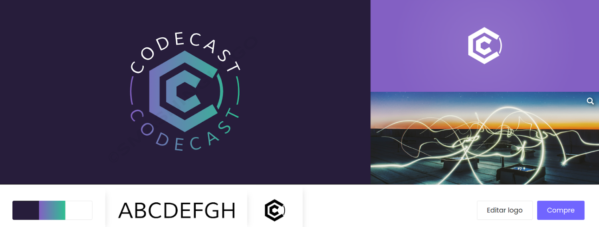
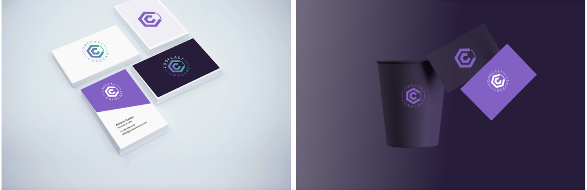
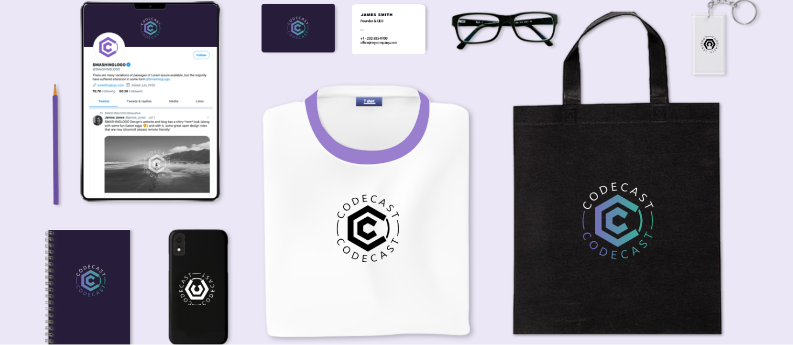
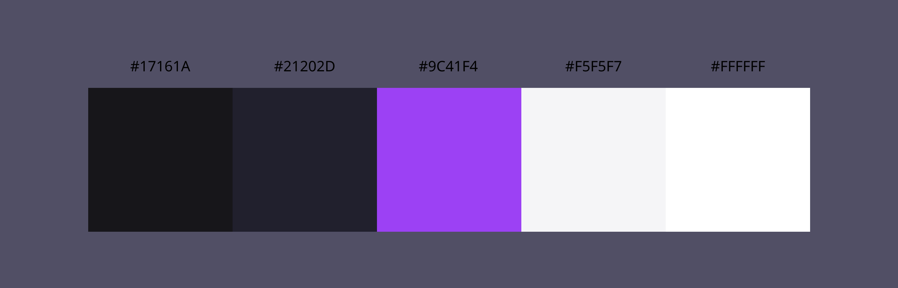
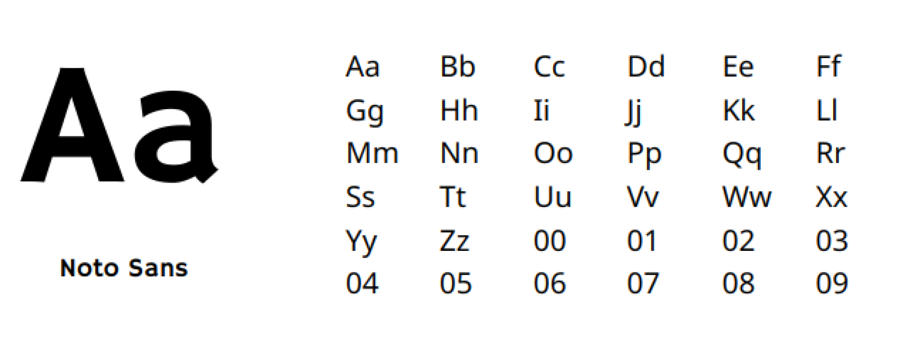

# Guia de Estilo

Este guia de estilo tem como função registrar as decisões de design relacionadas à implementação do projeto Codecast. Serve como uma ferramenta de comunicação entre a equipe de design e a equipe de desenvolvimento.

## Logo

  

## Identidade visual

## Paleta de Cores

A cor principal do sistema é o roxo #9C41F4, além dela são usadas cores neutras para compor o resto da interface.

## Tipografia

Optamos pela fonte Noto Sans para nosso site de streaming porque ela oferece excelente legibilidade em dispositivos variados, garantindo uma experiência de usuário suave. Além disso, sua variedade de estilos nos permite destacar informações importante. A natureza tipográfica neutra e contemporânea da Noto Sans se alinha com nossa estética minimalista e moderna. Em resumo, essa escolha prioriza usabilidade e design atraente para nossos usuários.

  

## Botões

Os botões utilizados podem possuir icones ou não, eles tem a cor principal do site, além disso contamos com outros elementos clicaveis que utilizam textos e ícones.

  

  

