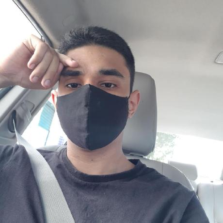

    

# Sobre

Este repositório é destinado ao grupo Archighosts - [**CodeCast**](https://github.com/luisalberto002/codecast), contém toda a documentação do   projeto da disciplina **Engenharia de Software III - Arquitetura e Design de Software**, ministrada pelo Professor **Cleber Araujo**, no **Instituto Federal do Piaui Campus Pedro II, durante o período de 2023/2**.

 

# Archighosts
### Sobre a Empresa
A empresa responsável pelo desenvolvimento do deste projeto é a "Archighost", uma equipe dedicada à inovação e excelência no campo da tecnologia. Apesar de ser uma equipe fictícia para os propósitos acadêmicos, a Archighost utiliza uma abordagem ágil e se compromete em fornecer soluções de software de alta qualidade.

### Equipe de Desenvolvimento
A equipe de desenvolvimento é composta por quatro profissionais especializados em diversas áreas, incluindo desenvolvimento de software, arquitetura de sistemas, gerenciamento de projetos e qualidade de software. Cada membro da equipe contribui com suas habilidades únicas e experiência, formando um grupo coeso e colaborativo.

# Contribuidores

|Foto | Matrícula | Nome | Função|  GitHub | E-mail|
|:--:|:--:|:--:|:--:|:--:|:--:|
|| 2022123TADS0071 | Luis Alberto | Arquiteto de software | [Luis Alberto](https://github.com/luisalberto002)|luisalber0525@gmail.com|
|| 2022123TADS0063 | João Vitor | Desenvolvedor Sênior | [João Vitor](https://github.com/vitor-Silva27)| ps.joaovitor27@gmail.com |
|| 2022123TADS0128 | Lucas Eduardo | Analista de requisitos | [Lucas Eduardo](https://github.com/LucaSoare)|lucas.soares.oliveira.p2@gmail.com|
|| 2022123TADS0195 | Alan Manoel | Gerente de qualidade | [Alan Manoel](https://github.com/AlanManoel)|alanmanoel517@gmail.com|
