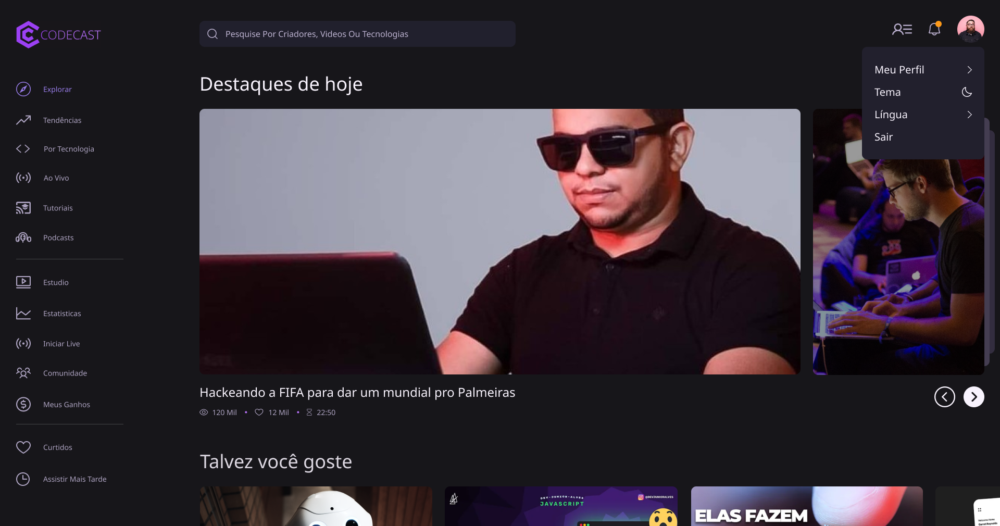
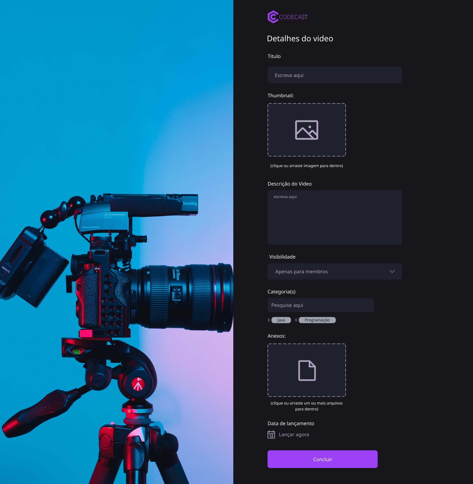

# Prototipação de Baixa Fidelidade

  
  
(Tela inicial)

  
  
(Tela de video)

  
  
(Tela de gravação de live)

  
  
(Tela de categoria por tecnologia)

# Vídeo do Protótipo
- [Insira um link ou anexe um vídeo que demonstre todas as funcionalidades e ações do protótipo.]

# Prototipação de Alta Fidelidade

  
  
(Tela de carregamento)

  
  
(Tela Principal)

  
  
(Página de video)

  
  
(Página de live)

  
  
(Tela de categoria por tecnologia)

  
  
(Tela de tendências)

  
  
(Página de usuário comum)

  
  
(Página de termos para virar criador de conteúdo)

  
  
(Página de usuário criador)

  
  
(Página de playlists)

  
  
(Históricos)

  
  
(Página sobre de usuario)

  
  
(Página principal com opção de mudar tema)

  
  
(Página principal com tema dark)

  
  
(Página de lançamento de videos dark)

  
  
(Página de criação/edição de videos dark)

  
  
(Página de escolha de detalhes de videos dark)

  
  
(Página de estatisticas de criador dark)

